# ManagementApp

Bienvenido al proyecto **ManagementApp**. Esta solución es un sistema de gestión modular compuesto por una aplicación web y microservicios dedicados.

## Estructura del Proyecto

*   **Web**: Frontend de la aplicación desarrollado en Angular.
*   **ClientOrderService**: Microservicio encargado de la gestión de órdenes de clientes desarrollado en PHP/LARAVEL.
*   **authService**: Microservicio responsable de la autenticación y seguridad desarrollado en .NET8.


## Diagrama de Flujo

```mermaid
flowchart LR
    %% Estilos
    classDef actor fill:#f9f9f9,stroke:#333,stroke-width:2px;
    classDef frontend fill:#e1f5fe,stroke:#0277bd,stroke-width:2px,color:#01579b;
    classDef backend fill:#e8f5e9,stroke:#2e7d32,stroke-width:2px,color:#1b5e20;

    User((👤 Usuario)):::actor

    subgraph Frontend [Frontend]
        Web["💻 Web (Angular)"]:::frontend
    end
    subgraph Backend [Backend Services]
        Auth["🛡️ authService"]:::backend
        Orders["📦 ClientOrderService"]:::backend
    end

    User -->|Interactúa| Web
    Web -->|Autenticación / Token| Auth
    Web -->|Gestión de Órdenes| Orders
```



## Requisitos Previos

*   Node.js 20 & npm (para el proyecto Web)
*   PHP 8.2 & Composer (ClientOrderService)
*   .NET8 (authService)
*   Docker & Docker Compose (para el despliegue completo)

## Ejecución Local

Instrucciones para levantar cada proyecto individualmente en un entorno de desarrollo.

### 1. Web (Frontend)

```bash
cd Web
npm install
ng serve
```
La aplicación estará disponible generalmente en `http://localhost:4200`.

### 2. ClientOrderService

```bash
cd ClientOrderService
composer install
cp .env.example .env
php artisan serve
```

### 3. authService

```bash
cd authService
dotnet build
dotnet run
```

## Ejecución de Pruebas

Comandos para ejecutar las suites de pruebas unitarias en cada módulo:

*   **ClientOrderService**: `php artisan test` (dentro de la carpeta `ClientOrderService`)
*   **authService**: `dotnet test` (dentro de la carpeta `authService`)

## Despliegue Completo con Docker

Para levantar todo el ecosistema (frontend, backend y bases de datos) de forma orquestada, utiliza Docker Compose desde la raíz del proyecto:

```bash
docker-compose up -d --build
```

Para detener los servicios:
```bash
docker-compose down
```

## Pruebas de API (Postman)

Se adjunta en el repositorio una **Colección de Postman**. Importa este archivo en tu cliente Postman para acceder a las peticiones preconfiguradas y probar los endpoints de los microservicios (`authService` y `ClientOrderService`) de manera integrada.
